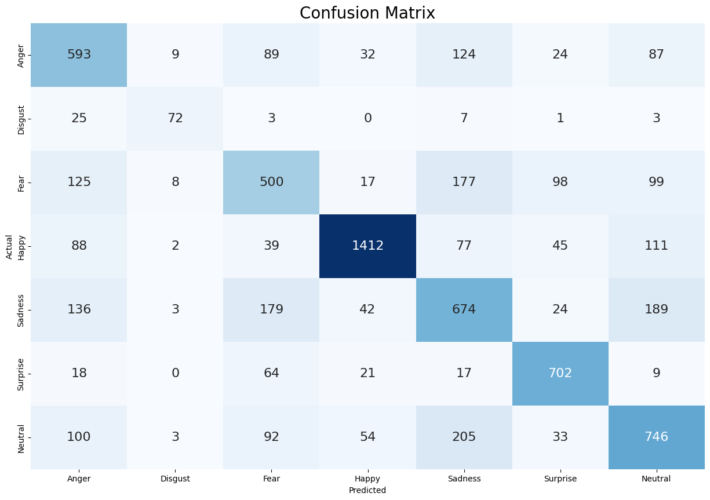

# Emotion Detection

An emotion recognition system built with computer vision and deep learning. This project detects faces from a webcam stream, classifies facial expressions into seven core emotions, and overlays expressive emojis on the live video.

## Project Overview

Emotion Detection combines a real-time OpenCV pipeline with a Keras CNN classifier and a Flask web interface. The result is a polished demo that shows how image processing, deep learning, and web presentation can work together for an intuitive user experience.

## Key Features

- Real-time face detection and tracking using OpenCV
- Emotion classification using a trained Keras CNN model
- Live emoji overlay for each detected emotion
- Responsive Flask web interface for easy interaction
- Supports 7 emotions: Angry, Disgusted, Fearful, Happy, Sad, Surprised, Neutral

## Visual Results

### Model Training and Validation


### Model Evaluation



### Application Demo

.png)
.png)


## Performance Summary

- Training accuracy: ~84%
- Validation accuracy: 78.78%
- Test accuracy: 65.5%

These curves show that the CNN model learns meaningful emotion features, but the drop in test accuracy indicates remaining challenges in real-world generalization, class balance, and dataset variation.

## Installation

1. **Clone the repository:**
   ```bash
   git clone https://github.com/11pranjal/faceEmotionDetection.git
   cd emotion-detection
   ```

2. **Create a virtual environment (recommended):**
   ```bash
   python -m venv venv
   ```

3. **Activate the virtual environment:**
   - On Windows:
     ```bash
     venv\Scripts\activate
     ```
   - On macOS/Linux:
     ```bash
     source venv/bin/activate
     ```

4. **Install dependencies:**
   ```bash
   pip install -r requirements.txt
   ```

5. **Verify required files:**
   - `model.keras` should be available in the project root
   - Emoji assets should be located in the `emoji/` folder

## Usage

1. Start the Flask app:
   ```bash
   python app.py
   ```

2. Open your browser and visit:
   ```
   http://localhost:5000
   ```

3. Click **Open Camera** to begin emotion detection.

4. The app will:
   - Access your webcam feed
   - Detect faces in real time
   - Classify expressions into seven emotions
   - Display matching emojis on the stream

## Architecture

The system is composed of the following components:

- **Face Detection:** OpenCV Haar cascades detect faces in each frame.
- **Emotion Classification:** A CNN predicts one of seven emotions from the cropped face image.
- **Emoji Overlay:** The predicted emotion triggers an emoji overlay on the video.
- **Flask Web App:** A lightweight front end serves the live camera view and controls.

## File Structure

```
emotion-detection/
├── app.py                 # Main Flask application
├── gui.py                 # Optional desktop GUI version
├── model.keras            # Trained emotion detection model
├── class.keras            # Alternative model file
├── requirements.txt       # Python dependencies
├── emoji/                 # Emoji assets for each emotion
├── static/
│   └── style/
│       └── style.css      # CSS styles
├── templates/
│   ├── index.html         # Home page
│   └── open_camera.html   # Camera interface
└── README.md              # Project documentation
```

## Troubleshooting

- **Camera unavailable:** Close other apps using the webcam and grant browser camera permissions.
- **Model load failure:** Confirm `model.keras` exists and is not corrupted.
- **Import errors:** Ensure the virtual environment is active and dependencies are installed.
- **Port conflict:** Change the Flask port if `5000` is already in use.

## Contributing

1. Fork the repository
2. Create a branch: `git checkout -b feature/your-feature`
3. Commit your changes: `git commit -m 'Add feature'`
4. Push to your branch: `git push origin feature/your-feature`
5. Open a pull request

## License

This project is licensed under the MIT License.

## Acknowledgments

- OpenCV for computer vision support
- Keras/TensorFlow for deep learning
- Flask for the web interface
